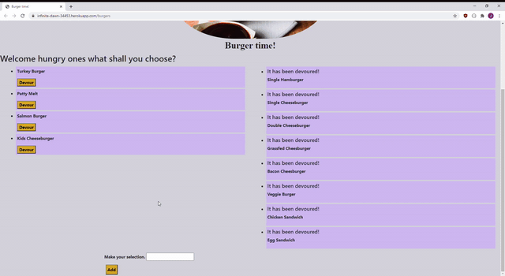
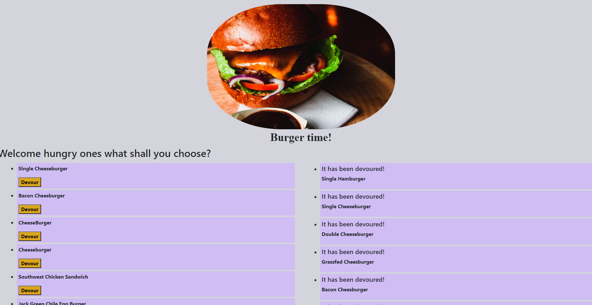

# burger-logger
In this assignment, you'll create a burger logger with MySQL, Node, Express, Handlebars and a homemade ORM (yum!). Be sure to follow the MVC design pattern; use Node and MySQL to query and route data in your app, and Handlebars to generate your HTML.

Link to Heroku deployment: https://infinite-dawn-34453.herokuapp.com/burgers

 

  

##  Table of Contents

*Description
*Installation
*Directory structure
*Contributing
*Tests
*Screenshots & Gif of Demo

##  Description

* Eat-Da-Burger! is a restaurant app that lets users input the names of burgers they'd like to eat.

* Whenever a user submits a burger's name, your app will display the burger on the left side of the page -- waiting to be devoured.

* Each burger in the waiting area also has a `Devour` button. When the user clicks it, the burger will move to the right side of the page.

* Your app will store every burger in a database, whether devoured or not.

##  Installation

node.js, Visual Studios, you will need to do an npm i as well as create a .gitignore file. mysql with also need to be downloaded, as well as the npm packages express, express-handlebars, and mysql.

#### Directory structure

All the recommended files and directories from the steps above should look like the following structure:

.
├── config
│   ├── connection.js
│   └── orm.js
│ 
├── controllers
│   └── burgers_controller.js
│
├── db
│   ├── schema.sql
│   └── seeds.sql
│
├── models
│   └── burger.js
│ 
├── node_modules
│ 
├── package.json
│
├── public
│   └── assets
│       ├── css
│       │   └── burger_style.css
│       └── img
│           └── burger.png
│   
│
├── server.js
│
└── views
    ├── index.handlebars
    └── layouts
        └── main.handlebars

##  Contributing

James Nowak

##  Gif of Demo & Screenshots of app

